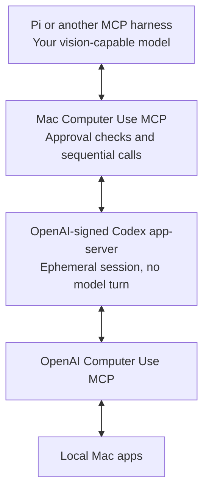

# Mac Computer Use MCP

**OpenAI’s native Mac controls. Your model. Your harness.**

A small, standalone MCP server that connects any compatible harness to the Computer Use backend installed by the official ChatGPT/Codex macOS app. Your model sees the app state and chooses each action. **No nested Codex agent, model subscription, or API key is used by this bridge.** Your harness still needs its own model access.

> Independent project, not affiliated with or endorsed by OpenAI. Uses experimental app-server interfaces and proprietary installed components. Tested with `codex-cli 0.153.3` and Computer Use app build `1000926`. This is an early release, not a promise of Codex-app performance or safety parity.

## How it works



OpenAI already ships a computer-use MCP server. Its tools also need the host/session context supplied by app-server. This bridge manages that context and re-exposes the tools to other MCP clients. It does not implement a second macOS automation engine.

## Requirements

- macOS with an unlocked graphical login session.
- Node.js **22.18 or newer**.
- The official **ChatGPT.app or Codex.app**, normally in `/Applications`.
- Computer Use installed through that app, including its per-user signed client.
- macOS Accessibility and Screen Recording permission for the official Computer Use components. Complete native setup yourself when prompted; this bridge does not modify macOS permissions.
- An MCP harness that supports image results. Form elicitation is recommended for interactive approvals.

## Install

Download/install the versioned package from this repository’s [releases](https://github.com/pgeske/mac-computer-use-mcp/releases):

```sh
npm install -g --ignore-scripts \
  https://github.com/pgeske/mac-computer-use-mcp/releases/download/v0.2.0/pgeske-mac-computer-use-mcp-0.2.0.tgz
mac-computer-use-mcp --doctor
```

Or build the source:

```sh
git clone https://github.com/pgeske/mac-computer-use-mcp.git
cd mac-computer-use-mcp
npm ci --ignore-scripts
npm run build
node dist/cli.js --doctor
```

`--doctor` verifies the installed OpenAI executables and reports the app-server version. It does **not** capture your screen or claim that macOS permissions are ready.

## Connect a harness

Use your harness’s standard stdio MCP configuration:

```json
{
  "mcpServers": {
    "mac-computer-use": {
      "command": "mac-computer-use-mcp",
      "args": []
    }
  }
}
```

For a source checkout, use `"command": "node"` and set `args` to the **absolute path** of `dist/cli.js`. GUI-launched clients may also require an absolute executable path because their PATH differs from your terminal’s.

### Pi

Install [Pi’s MCP adapter](https://www.npmjs.com/package/pi-mcp-adapter), then put the MCP entry in `~/.config/mcp/mcp.json` or your project’s `.mcp.json`:

```sh
pi install npm:pi-mcp-adapter
```

Restart Pi or run `/reload` after configuring the server. Ask:

> Use mac-computer-use to calculate 4 + 5 in Calculator. Inspect the result and stop the computer-use session when finished.

The model should use the exact bundle identifier `com.apple.calculator`. Select your preferred vision-capable model in Pi; the bridge does not choose or run one.

To disable it in Pi: `/mcp disable mac-computer-use`, then `/reload`. To re-enable: `/mcp enable mac-computer-use`, then `/reload`.

### Trust a specific app

By default, **one host-side MCP approval enables computer use across apps for the current session**. After you approve, routine inspection, navigation, clicking, and typing do not prompt again. Stop, five-minute idle expiry, errors, or reconnecting revoke that approval. This session belongs to one server connection, not to all harnesses or the lifetime of a Pi conversation.

Native OpenAI/macOS permission prompts remain separate. Consequential actions—sending, deletion, purchases, and security changes—still require confirmation through the calling agent's instructions, not a semantic classifier in this bridge.

Clients without form elicitation fail closed. For a specific app you explicitly want available without the initial bridge session prompt:

```json
{
  "mcpServers": {
    "mac-computer-use": {
      "command": "mac-computer-use-mcp",
      "args": ["--trust-app", "com.apple.calculator"]
    }
  }
}
```

Repeat `--trust-app` to add exact bundle IDs. Names, paths, and wildcards are rejected. Native OpenAI/macOS permission requests are **still forwarded**, not auto-approved; a first-time native prompt can require an interactive client even for a trusted app. Restart the server to revoke bridge trust or clear the configuration.

App trust authorizes access, not arbitrary purchases, messages, or deletion. Trusting a browser or terminal grants a broad practical capability; use narrow task instructions and confirm consequential actions. See [SECURITY.md](SECURITY.md).

## Tools

The bridge discovers and validates the **live tool schemas** from your installed backend. It exposes only these recognized names when available:

| Tool                       | Purpose                                                                     |
| -------------------------- | --------------------------------------------------------------------------- |
| `get_app_state`            | Start/inspect an app session; accessibility text and screenshot             |
| `list_apps`                | Read the native app inventory; covered by session approval                  |
| `click`, `drag`, `scroll`  | Operate UI elements or screenshot coordinates                               |
| `press_key`, `type_text`   | Keyboard input                                                              |
| `set_value`, `select_text` | Accessible controls and text selection                                      |
| `perform_secondary_action` | An accessibility action exposed by an element                               |
| `paste`                    | Formatted/multiline paste, **only if advertised by the native MCP backend** |
| `computer_use_status`      | Bridge state and policy; no desktop read                                    |
| `computer_use_stop`        | Release the backend session and invalidate inspected app state              |

The JavaScript `@oai/sky` API and native MCP schemas are not identical. Do not assume options such as `disableDiff` or formatted `paste` exist just because the JavaScript API supports them. Use the advertised schema.

Workflow: **inspect → act sequentially → inspect/verify → stop**. An action requires a successful inspection of the same app in the current session. Session expiry, errors, or stop invalidate that inspection. No failed action is automatically retried, because it may already have taken effect.

## Safety and privacy

- Verifies both OpenAI executables’ signatures and Team ID before launch.
- Keeps the broker and native client's auxiliary host connection on a private temporary configuration. Only the verified runtime app is linked into it; no user configuration or credentials are linked. Does not forward your shell environment, API keys, or Codex credential store.
- Uses an ephemeral thread with **`on-request` approval and `read-only` sandbox policy**. The latter is a Codex thread policy, **not** a restriction on desktop mutations.
- Exposes no generic RPC, shell, JavaScript execution, or model-turn tool. Unexpected model-turn events stop the connection.
- Returns screenshots as native MCP image blocks. The bridge does not write screenshot or app-content logs. **Your harness/model receives this content and may retain it.** OpenAI’s installed service has its own behavior and settings.
- Serializes calls within a server instance. Idle sessions expire after five minutes; stop/cancellation interrupt active work and invalidate queued actions. Orderly shutdown closes the backend's input; unexpected exits or forced cleanup report uncertainty and retain private state for inspection.
- Does not automatically grant macOS permissions or silently approve native permission requests.

**Only run one computer-use harness on a desktop at a time.** Separate server instances do not coordinate a global desktop lock. Do not use this on a sensitive live account without understanding the scope of app access. This is not an OS sandbox or a defense against a fully privileged malicious harness.

## Options

```text
--app PATH             Select the official .app bundle
--trust-app BUNDLE_ID   Preauthorize an exact app; repeatable
--read-only            Reject UI actions (inspection can still launch an app)
--idle-seconds N       Idle release interval, 10–3600 seconds; default 300
--doctor               Verify installation without desktop access
--help                 Show help
```

## Troubleshooting

- **Missing client:** finish Computer Use installation in the official app. We do not download or redistribute OpenAI’s binaries.
- **Signature failure:** reinstall/update the official app; do not disable verification.
- **Permission cancelled:** approve the native request in an interactive MCP client. A headless client cannot answer it automatically.
- **Timeout/cancelled action:** stop, reconnect, and inspect the app before retrying. The action may already have happened.
- **Backend changed:** run `--doctor`, inspect tool discovery, and report the app-server version and a sanitized error. Never include screenshots, credentials, or private app content in an issue.

## Development

```sh
npm ci --ignore-scripts
npm run build
npm run lint
npm run typecheck
npm test
```

Tests use fake backends and in-memory MCP transports; they do not control your desktop. For the separate opt-in integration test:

```sh
MAC_COMPUTER_USE_LIVE=1 npm run test:live
```

That test explicitly permits only the native Calculator approval, clears its current entry, computes `4 + 5`, verifies the result text is `9`, checks for an image response, and stops the session. It leaves Calculator open and changes its current calculation/history.

### Primary implementation references

- [OpenAI app-server protocol](https://github.com/openai/codex/blob/main/codex-rs/app-server/README.md): initialization, ephemeral threads, MCP discovery and direct tool calls.
- The installed official `computer-use/.mcp.json`, launcher, and tool schemas.
- [MCP specification](https://modelcontextprotocol.io/specification/2025-11-25) and official TypeScript SDK.

Implemented independently; no community computer-use wrapper is a dependency or vendored source.
